Ok, Arthur\! Você quer o `README.md` completo em formato de código (raw Markdown), pronto para ser copiado e colado. Aqui está:


# Monitoramento de Serviço Web e Configuração de Ambiente

Este projeto fornece um conjunto de scripts Bash para configurar um ambiente de monitoramento de serviço web (Nginx) em um servidor Linux, além de gerenciar a página web padrão e enviar notificações de status via webhook (como para o Discord). Ele é ideal para ser implantado automaticamente em uma **instância EC2** usando **User Data**.

---

## 💻 Tecnologias Utilizadas

Este projeto faz uso de algumas tecnologias e ferramentas essenciais para a sua operação:

* **Bash (Shell Scripting):** A linguagem principal de todos os scripts, responsável pela automação das tarefas.
* **Nginx:** Um servidor web leve e de alta performance, utilizado para servir o conteúdo HTML/CSS.
* **Cron:** Um agendador de tarefas em sistemas Unix/Linux, usado para executar o script de monitoramento em intervalos regulares.
* **cURL:** Ferramenta de linha de comando para transferir dados com sintaxe de URL, essencial para verificar o status do Nginx e enviar webhooks.
* **UFW (Uncomplicated Firewall):** Um frontend para `iptables` que simplifica a configuração do firewall, garantindo que o Nginx esteja acessível.
* **HTML & CSS:** Utilizados para criar uma página web de exemplo (seu currículo) que será servida pelo Nginx.
* **Variáveis de Ambiente (`.env`):** Para gerenciar configurações sensíveis, como URLs de webhook.
* **AWS EC2 User Data:** Um script que é executado na primeira inicialização de uma instância EC2, permitindo automatizar a configuração inicial do servidor.

---

## 📁 Estrutura do Projeto

O projeto é composto por alguns scripts principais e arquivos de configuração:

* **`user-data.sh`**: O script principal que será passado como User Data para uma instância EC2. Ele orquestra a criação dos outros scripts e arquivos necessários.
* **`monitor.sh`**: O script de monitoramento. Ele verifica o status do Nginx, define uma mensagem e cor com base no código HTTP, e envia uma notificação formatada (Embed) via webhook.
* **`test.sh`**: Um script auxiliar que verifica e instala as dependências do sistema (cron, nginx, etc.), e configura a tarefa cron para o `monitor.sh`.
* **`/var/log/monitoramento.log`**: O arquivo de log onde os códigos de status do Nginx são registrados.
* **`/var/www/html/index.html`**: O arquivo HTML da página web (seu currículo) que será servida pelo Nginx.
* **`/var/www/html/css/style.css`**: O arquivo CSS que estiliza a página `index.html`.
* **`~/.env`**: Um arquivo oculto que armazena variáveis de ambiente como `WEBHOOK_URL`.

---

## 🚀 Como Usar e Implantar (User Data na EC2)

A forma mais eficiente de implantar este projeto é utilizando o **User Data** de uma instância EC2 na Amazon Web Services. Isso automatiza todo o processo de configuração do servidor desde o momento de sua inicialização.

### Pré-requisitos

* Uma conta AWS ativa.
* Um **Webhook URL** (por exemplo, do Discord) para receber as notificações.

### Passo a Passo para Implantação na EC2

### 1. Acessar o Console AWS

Comece acessando sua conta AWS. Na página inicial do console, você verá seus serviços visitados recentemente e favoritos.

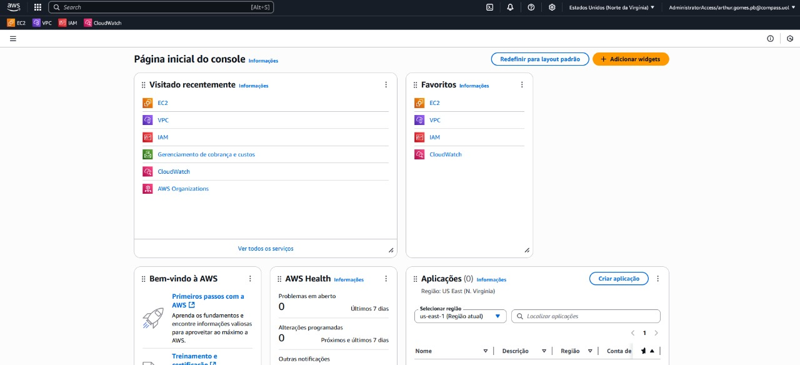

### 2. Navegar para o Serviço VPC

Na barra de pesquisa superior, digite "VPC" e selecione o serviço "VPC - Isolated Cloud Resources" que aparecerá nos resultados.

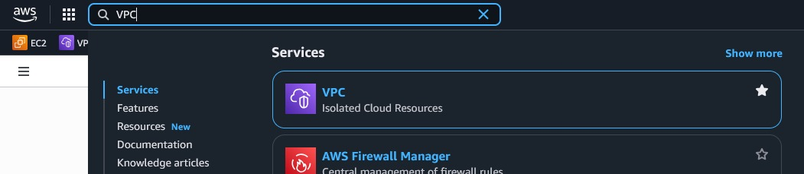

### 3. Iniciar a Criação de uma VPC

Dentro do painel da VPC, clique em "Criar VPC" para iniciar o assistente de criação.


### 4. Configurar a VPC e Sub-redes

Na tela de configuração da VPC:
* Selecione a opção **"VPC e muito mais"**.
* Para "Geração automática da etiqueta de nome", selecione **"Gerar automaticamente"**. O nome padrão será "NOME-ESCOLHIDO".
* O "Bloco CIDR IPv4" será preenchido como `10.0.0.0/16`. Mantenha o padrão.
* Em "Número de zonas de disponibilidade (AZs)", selecione **"2"**.

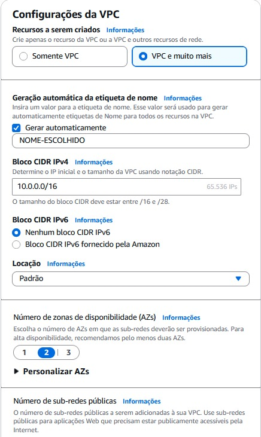

### 5. Configurar Gateways NAT e Endpoints da VPC

Continuando na mesma página de configuração da VPC:
* Para "Gateways NAT (USD)", selecione **"Nenhum"** (a menos que precise de conectividade de saída para sub-redes privadas para a internet).
* Para "Endpoints da VPC", selecione **"Gateway do S3"** para permitir que recursos em suas sub-redes acessem o S3 de forma privada, sem passar pela internet.
* Em "Opções de DNS", certifique-se de que **"Habilitar nomes de host DNS"** e **"Habilitar resolução de DNS"** estejam marcados.

Finalmente, clique em **"Criar VPC"**.

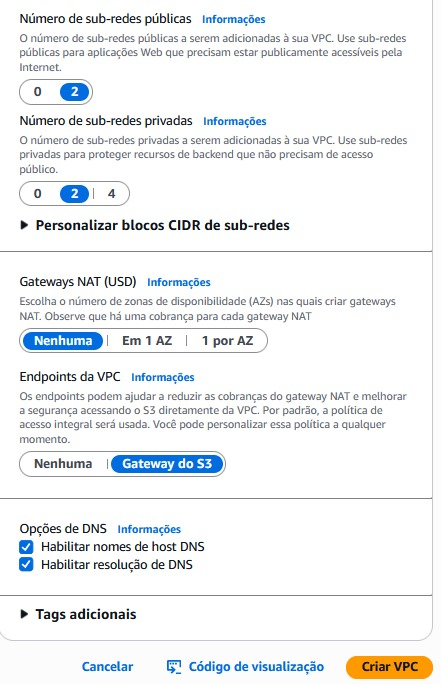

### 6. Verificação de Sucesso da Criação da VPC

Após clicar em "Criar VPC", você será redirecionado para uma tela que mostra o progresso da criação dos recursos. Uma série de marcas de seleção verdes indicará o sucesso de cada etapa.

Clique em "Visualizar VPC" para ver os detalhes da VPC criada.

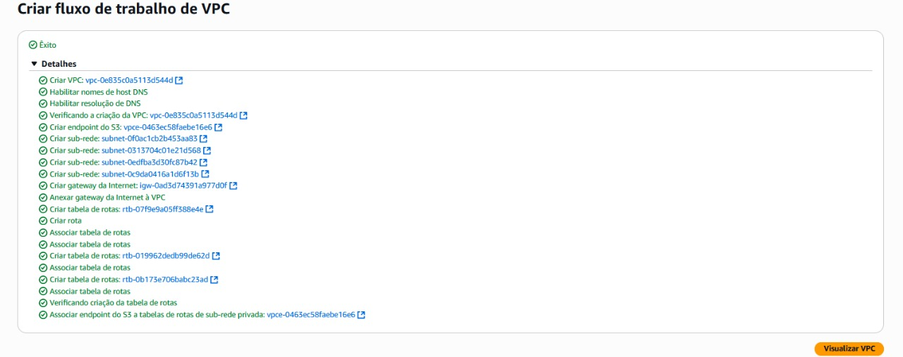

### 7. Navegar para o Serviço EC2 (para Security Groups)

Agora que sua VPC está criada, vamos configurar um Security Group. Na barra de pesquisa superior, digite "EC2" e selecione o serviço "EC2 - Virtual Servers in the Cloud".

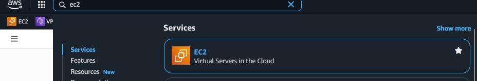

### 8. Acessar o Painel EC2

No painel do EC2, clique em "Iniciar instância" ou navegue pelo menu lateral esquerdo até a seção "Rede e segurança" para encontrar "Grupos de segurança".

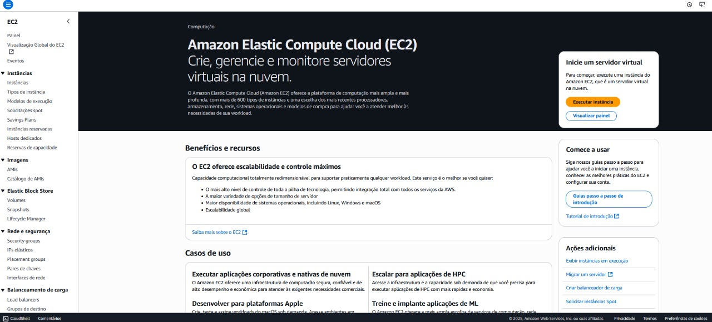

### 9. Acessar Grupos de Segurança

No menu lateral esquerdo do painel EC2, localize e clique em "Security Groups" (Grupos de Segurança) na seção "Rede e segurança". Aqui você verá uma lista de grupos de segurança existentes.

Clique em **"Criar grupo de segurança"**.

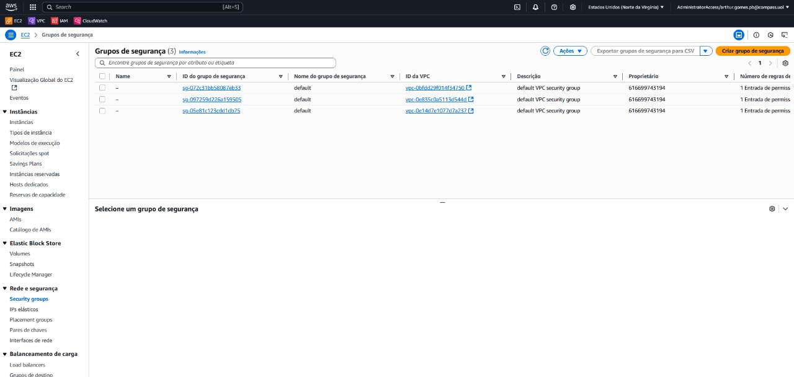

### 10. Detalhes Básicos do Grupo de Segurança

Na tela de criação do grupo de segurança:
* Para "Nome do grupo de segurança", insira um nome descritivo (ex: `SEU_NOME_SG` ou `WEBSERVER_SG`).
* Para "Descrição", forneça uma descrição obrigatória (ex: `Grupo de segurança para acesso a servidores web`).
* Para "VPC", selecione a **VPC que você acabou de criar** no passo anterior (ela aparecerá como "VCP CRIADA ANTERIORMENTE" no dropdown, substituindo o nome que você escolheu ou o gerado automaticamente).

Continue configurando as regras de entrada e saída conforme suas necessidades (não mostrado nas imagens fornecidas), e finalize a criação do Security Group.

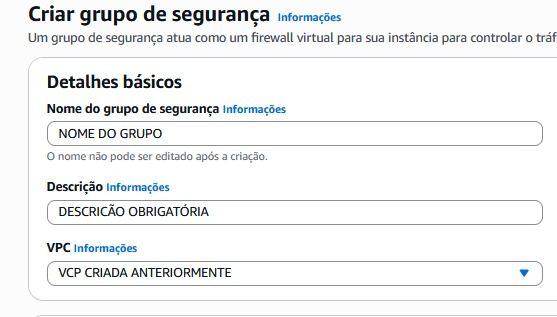


   

# Guia de Criação de VPC e Security Group e Lançamento de Instância EC2 na AWS

Este guia passo a passo demonstra como criar uma Virtual Private Cloud (VPC), configurar um Security Group e lançar uma instância EC2 na Amazon Web Services (AWS), configurando os recursos essenciais para sua infraestrutura de rede na nuvem.

---

## Passo a Passo

### 1. Acessar o Console AWS

Comece acessando sua conta AWS. Na página inicial do console, você verá seus serviços visitados recentemente e favoritos.


### 2. Navegar para o Serviço VPC

Na barra de pesquisa superior, digite "VPC" e selecione o serviço "VPC - Isolated Cloud Resources" que aparecerá nos resultados.


### 3. Iniciar a Criação de uma VPC

Dentro do painel da VPC, clique em "Criar VPC" para iniciar o assistente de criação.


### 4. Configurar a VPC e Sub-redes

Na tela de configuração da VPC:
* Selecione a opção **"VPC e muito mais"**.
* Para "Geração automática da etiqueta de nome", selecione **"Gerar automaticamente"**. O nome padrão será "NOME-ESCOLHIDO".
* O "Bloco CIDR IPv4" será preenchido como `10.0.0.0/16`. Mantenha o padrão.
* Em "Número de zonas de disponibilidade (AZs)", selecione **"2"**.


### 5. Configurar Gateways NAT e Endpoints da VPC

Continuando na mesma página de configuração da VPC:
* Para "Gateways NAT (USD)", selecione **"Nenhum"** (a menos que precise de conectividade de saída para sub-redes privadas para a internet).
* Para "Endpoints da VPC", selecione **"Gateway do S3"** para permitir que recursos em suas sub-redes acessem o S3 de forma privada, sem passar pela internet.
* Em "Opções de DNS", certifique-se de que **"Habilitar nomes de host DNS"** e **"Habilitar resolução de DNS"** estejam marcados.

Finalmente, clique em **"Criar VPC"**.


### 6. Verificação de Sucesso da Criação da VPC

Após clicar em "Criar VPC", você será redirecionado para uma tela que mostra o progresso da criação dos recursos. Uma série de marcas de seleção verdes indicará o sucesso de cada etapa.

Clique em "Visualizar VPC" para ver os detalhes da VPC criada.


### 7. Navegar para o Serviço EC2 (para Security Groups)

Agora que sua VPC está criada, vamos configurar um Security Group. Na barra de pesquisa superior, digite "EC2" e selecione o serviço "EC2 - Virtual Servers in the Cloud".


### 8. Acessar o Painel EC2

No painel do EC2, clique em "Iniciar instância" ou navegue pelo menu lateral esquerdo até a seção "Rede e segurança" para encontrar "Grupos de segurança".


### 9. Acessar Grupos de Segurança

No menu lateral esquerdo do painel EC2, localize e clique em "Security Groups" (Grupos de Segurança) na seção "Rede e segurança". Aqui você verá uma lista de grupos de segurança existentes.

Clique em **"Criar grupo de segurança"**.


### 10. Detalhes Básicos do Grupo de Segurança

Na tela de criação do grupo de segurança:
* Para "Nome do grupo de segurança", insira um nome descritivo (ex: `SEU_NOME_SG` ou `WEBSERVER_SG`).
* Para "Descrição", forneça uma descrição obrigatória (ex: `Grupo de segurança para acesso a servidores web`).
* Para "VPC", selecione a **VPC que você acabou de criar** no passo anterior.


### 11. Configurar Regras de Entrada (Inbound Rules)

Na seção "Regras de entrada", você definirá qual tráfego é permitido para dentro de sua instância.
* **Adicionar regra SSH:**
    * Tipo: `SSH`
    * Protocolo: `TCP`
    * Intervalo de portas: `22`
    * Origem: `Meu IP` (O AWS preencherá automaticamente com o seu IP público, permitindo acesso SSH apenas do seu local).
* **Adicionar regra HTTP:**
    * Tipo: `HTTP`
    * Protocolo: `TCP`
    * Intervalo de portas: `80`
    * Origem: `Qualquer lugar` (`0.0.0.0/0`), permitindo que qualquer IP acesse sua instância via HTTP.

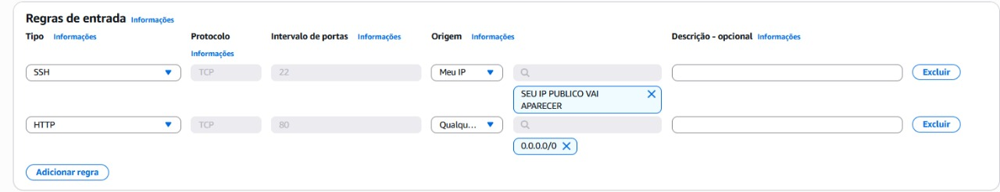

### 12. Configurar Regras de Saída (Outbound Rules)

Na seção "Regras de saída", você define qual tráfego é permitido da sua instância para fora. Por padrão, geralmente todo o tráfego de saída é permitido (`All traffic`, `0.0.0.0/0`).
No exemplo, as regras de saída são para:
* **HTTP:**
    * Tipo: `HTTP`
    * Protocolo: `TCP`
    * Intervalo de portas: `80`
    * Destino: `Qualquer lugar` (`0.0.0.0/0`)
* **HTTPS:**
    * Tipo: `HTTPS`
    * Protocolo: `TCP`
    * Intervalo de portas: `443`
    * Destino: `Qualquer lugar` (`0.0.0.0/0`)

Após configurar as regras, clique em "Criar grupo de segurança" (esta ação não é mostrada na imagem, mas é a próxima etapa após configurar as regras).

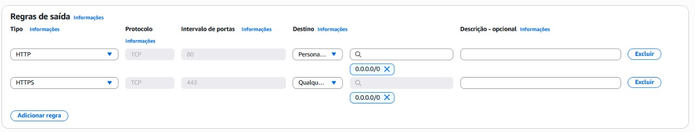

### 13. Revisar Detalhes do Grupo de Segurança Criado

Após a criação, você pode revisar os detalhes do seu novo grupo de segurança. Verifique o "Nome do grupo de segurança", "Descrição", e as "Regras de entrada" que você configurou (SSH na porta 22 do seu IP e HTTP na porta 80 de qualquer lugar).

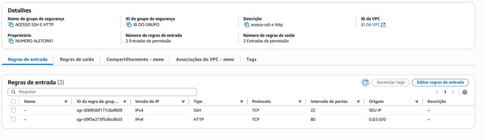

### 14. Navegar para Instâncias EC2

No menu lateral esquerdo do painel EC2, clique em "Instâncias" sob a seção "Instâncias".

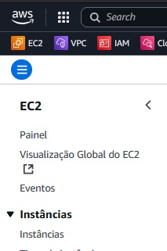

### 15. Iniciar o Lançamento de uma Nova Instância

Na tela de Instâncias, se você não tiver nenhuma instância, verá a opção "Executar instâncias". Clique em **"Executar instâncias"** (botão laranja no canto superior direito).

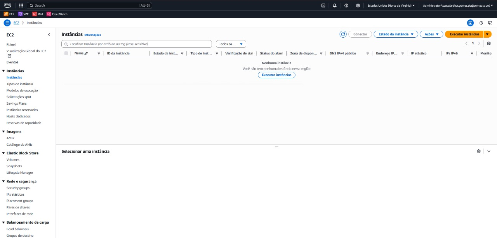

### 16. Configurar Nome e AMI

Na tela de lançamento de instância:
* Em "Nome e tags", insira um **"Nome da instância"** (ex: `MeuServidorWeb`).
* Em "Imagens de aplicação e de sistema operacional (imagem de máquina do Amazon - AMI)", selecione a opção **"Ubuntu"** na guia "Início rápido". A imagem "Ubuntu Server 24.04 LTS (HVM), SSD Volume Type" é uma boa escolha e geralmente é qualificada para o nível gratuito.

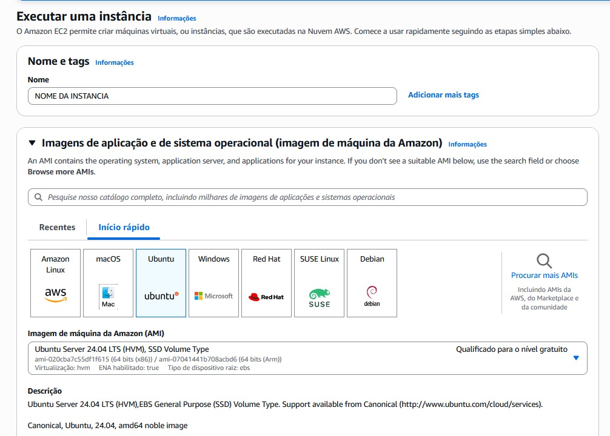

### 17. Escolher Tipo de Instância e Par de Chaves

Continuando na tela de lançamento de instância:
* Em "Tipo de instância", o `t2.micro` é geralmente selecionado por padrão e é qualificado para o nível gratuito. Mantenha essa opção.
* Em "Par de chaves (login)", clique em **"Criar novo par de chaves"** se você ainda não tiver um.

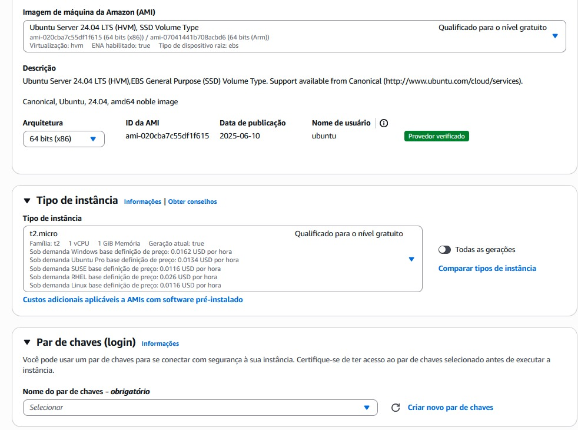

### 18. Criar Novo Par de Chaves

Na janela pop-up "Criar par de chaves":
* Insira um **"Nome do par de chaves"** (ex: `minha-chave-ec2`).
* Para "Tipo de par de chaves", mantenha **"RSA"**.
* Para "Formato de arquivo de chave privada", mantenha **".pem"** (para uso com OpenSSH em Linux/macOS).
Clique em **"Criar par de chaves"**.

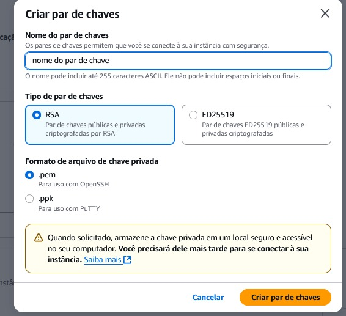

### 19. Salvar o Arquivo .pem do Par de Chaves

Após clicar em "Criar par de chaves", o navegador fará o download automático do arquivo `.pem` com o nome que você especificou (ex: `minha-chave-ec2.pem`).

---
**⚠️ AVISO IMPORTANTE! ⚠️**

**Este arquivo `.pem` é sua CHAVE PRIVADA para acessar a instância. Ele é exibido e baixado SOMENTE UMA VEZ. É CRÍTICO que você salve este arquivo em um local SEGURO e faça backup dele. Se você perder esta chave, NÃO conseguirá mais se conectar à sua instância EC2!**
---

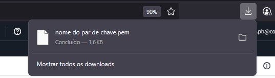

### 20. Configurações de Rede (Parte 1)

Na seção "Configurações de rede":
* Verifique se a **VPC que você criou** está selecionada (`VPC CRIADA ANTERIORMENTE` - ex: `vpc-0bffdd29f014f34750`).
* Em "Sub-rede", selecione **"QUALQUER UMA DAS DUAS SUB REDES PUBLICAS"** (ex: `subnet-0040b8124dad5a89b`).
* Para "Atribuir IP público automaticamente", mantenha **"Habilitar"**.

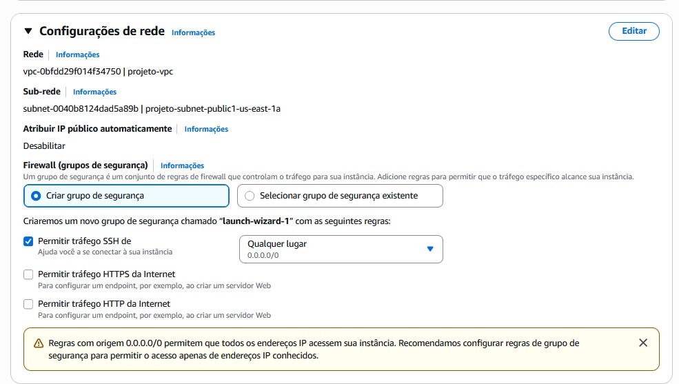

### 21. Configurações de Rede (Parte 2 - Firewall)

Ainda na seção "Configurações de rede", na subseção "Firewall (grupos de segurança)":
* Selecione **"Selecionar grupo de segurança existente"**.
* No dropdown "Selecionar grupos de segurança", escolha o **"SECURITY GROUP CRIADO ANTERIORMENTE"** que você configurou nos passos 10 a 12 (ele aparecerá com o nome que você deu).

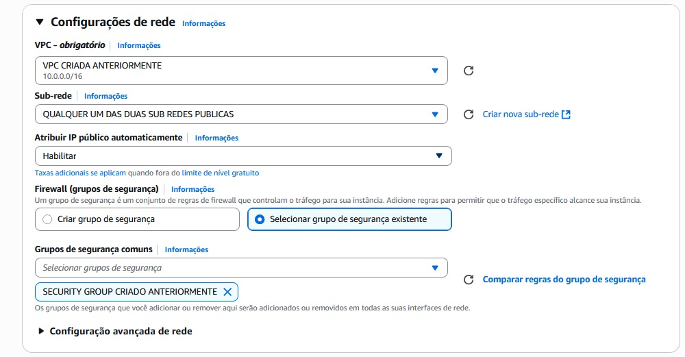

### 22. Adicionar Dados do Usuário (User Data)

Role a página para baixo até a seção "Dados do usuário (opcional)". Aqui, você pode inserir um script Bash para ser executado na inicialização da instância.

* Cole aqui o script abaixo (`user-data.sh`) dentro da caixa de texto.
   ```
    #!/usr/bin/env bash
    #
    # user.sh - Envia código via user-data via aws
    #
    # Autor:      Arthur Henrike L.M Gomes
    # Manutenção: Arthur Henrike L.M Gomes
    #
    # ------------------------------------------------------------------------ #
    #  Este programa irá criar automaticamente os arquivos monitor.sh, test.sh, index.html e style.css
    # ------------------------------------------------------------------------ #
    
    # ------------------------------- SETUP INICIAL DO SISTEMA ----------------------------------------- #
    # Instalação de dependências.
    sudo apt-get update -y
    sudo apt-get install -y curl cron nginx ufw
    
    # Garante permissões corretas para o diretório web
    sudo mkdir -p /var/www/html/css
    sudo chown -R www-data:www-data /var/www/html
    sudo chmod -R 755 /var/www/html
    
    # Inicia e habilita cron e nginx
    sudo systemctl start cron || true
    sudo systemctl enable cron || true
    sudo systemctl start nginx || true
    sudo systemctl enable nginx || true
    
    # CORREÇÃO CRÍTICA: Liberar a porta SSH (22) ANTES de ativar o firewall.
    sudo ufw allow ssh
    sudo ufw allow 'Nginx HTTP'
    sudo ufw --force enable
    # ------------------------------------------------------------------------ #
    # ------------------------------- VARIÁVEIS ----------------------------------------- #
    LOG="/var/log/monitoramento.log"
    # CORREÇÃO: Caminho absoluto e explícito para os scripts para maior robustez.
    # O usuário padrão no Ubuntu da AWS é 'ubuntu'.
    TARGET_DIR="/home/ubuntu/scripts"
    
    
    # ------------------------------------------------------------------------ #
    
    # ------------------------------- TESTES ----------------------------------------- #
    # Garante que o diretório de scripts exista e pertence ao usuário correto
    mkdir -p "$TARGET_DIR"
    sudo chown ubuntu:ubuntu "$TARGET_DIR"
    
    # Cria o arquivo de log
    [ ! -e "$LOG" ] && sudo touch "$LOG" && sudo chmod 666 "$LOG"
    
    # (O restante dos testes é bom, mas a configuração inicial já cuida deles)
    
    # --------------------------------------------------------------------------------- #
    
    
    
    # ------------------------------- FUNÇÕES ----------------------------------------- #
    CriarMonitor() {
        cat <<'EOF' > "$TARGET_DIR/monitor.sh"
    #!/usr/bin/env bash
    #
    # monitor.sh - Envia mensagem Embed personalizada via webhook
    #
    
    # --- Variáveis ---
    TARGET_DIR="/home/ubuntu/scripts" # Confirme que este caminho é o mesmo que no user-data.sh
    source "$TARGET_DIR/.env" # Carrega WEBHOOK_URL
    COR=0
    MENSAGEM=""
    DATA=$(date -u +'%Y-%m-%dT%H:%M:%S.000Z')
    
    STATUS_CODES=$(curl -s -o /dev/null -w "%{http_code}" "$URL_SERVIDOR")
    URL_IMAGEM="https://cdn.futura-sciences.com/buildsv6/images/largeoriginal/c/f/b/cfb0ad9812_72314_http.jpg"
    LOG="/var/log/monitoramento.log"
    
    # --- Funções ---
    VerificarStatusCode() {
        case $STATUS_CODES in
            000) MENSAGEM="Servidor Nginx está fora do ar. Erro de rede/serviço inalcançável." ;;
            200) MENSAGEM="Servidor Nginx está funcionando." ;;
            201) MENSAGEM="Criado: A requisição foi bem-sucedida e um novo recurso foi criado." ;;
            202) MENSAGEM="Aceito: A requisição foi aceita para processamento." ;;
            204) MENSAGEM="Sem conteúdo: O servidor processou a requisição com sucesso, mas não há conteúdo para enviar." ;;
            301) MENSAGEM="Movido permanentemente: O recurso solicitado foi movido permanentemente para uma nova URL." ;;
            302) MENSAGEM="Encontrado (Redirecionamento temporário): O recurso solicitado está temporariamente em uma URL diferente." ;;
            304) MENSAGEM="Não modificado: O recurso solicitado não foi modificado desde a última requisição." ;;
            400) MENSAGEM="Requisição inválida: Erro do cliente." ;;
            404) MENSAGEM="Rota não encontrada." ;;
            500) MENSAGEM="Erro interno do servidor." ;;
            504) MENSAGEM="Gateway Timeout: O servidor não recebeu uma resposta a tempo." ;;
            *) MENSAGEM="Código de status HTTP não reconhecido: $STATUS_CODES" ;;
        esac
        echo "$(date): Status code: $STATUS_CODES - $MENSAGEM" >> "$LOG"
    }
    
    ObterCor() {
        case $STATUS_CODES in
            2*) COR=3066993        ;;
            4*|5*|000) COR=15158332 ;;
            3*) COR=16776960       ;;
            *)  COR=8359053        ;;
        esac
    }
    
    EnviarMensagem() {
        if [ -z "$WEBHOOK_URL" ] || [ "$WEBHOOK_URL" == "COLOQUE_SEU_WEBHOOK_DO_DISCORD_AQUI" ]; then
            return 1
        fi
    
        JSON=$(cat <<_EOF_
    {
        "embeds": [
        {
            "title": "RELATÓRIO DE DISPONIBILIDADE DO SERVIDOR",
            "description": "Verificação do Status HTTP do Host",
            "color": $COR,
            "author": {
                "name": "Monitoramento Automático EC2"
            },
            "fields": [
            {
                "name": "Host Verificado",
                "value": "\`http://$URL_SERVIDOR\`",
                "inline": false
            },
            {
                "name": "Status Code",
                "value": "**$STATUS_CODES**",
                "inline": true
            },
            {
                "name": "Mensagem",
                "value": "$MENSAGEM",
                "inline": false
            },
            {
                "name": "Origem da Verificação",
                "value": "🇧🇷 Vilhena, Brasil (EC2)",
                "inline": false
            }
            ],
            "image": {
            "url": "$URL_IMAGEM"
            },
            "thumbnail": {
            "url": "https://cdn.futura-sciences.com/buildsv6/images/largeoriginal/c/f/b/cfb0ad9812_72314_http.jpg"
            },
            "timestamp": "$DATA"
        }
        ]
    }
    _EOF_
    )
        curl -X POST -H "Content-Type: application/json" -d "$JSON" "$WEBHOOK_URL" &>> "$LOG"
    }
    
    # --- Execução ---
    VerificarStatusCode
    ObterCor
    EnviarMensagem
    EOF
        chmod +x "$TARGET_DIR/monitor.sh"
    }
    
    CriarTest() {
        cat <<'EOF' > "$TARGET_DIR/test.sh"
    #!/usr/bin/env bash
    # test.sh - Configura cron para o monitoramento
    #
    
    # --- Variáveis ---
    LOG="/var/log/monitoramento.log"
    TEMP=$(mktemp)
    trap 'rm -f "$TEMP"' EXIT
    SCRIPT_DIR=$(dirname "$(realpath "$0")")
    
    # --- Funções ---
    IniciarCrontab(){
        local MONITOR_PATH="$SCRIPT_DIR/monitor.sh"
        # Adiciona a tarefa ao crontab se ela ainda não existir, usando flock.
        if ! (sudo crontab -l 2>/dev/null | grep -qF "$MONITOR_PATH"); then
            (sudo crontab -l 2>/dev/null; echo "* * * * * /usr/bin/flock -xn $MONITOR_PATH -c \"/bin/bash $MONITOR_PATH\" &>> $LOG") | sudo crontab -
        fi
    }
    
    # --- Execução ---
    IniciarCrontab
    EOF
        chmod +x "$TARGET_DIR/test.sh"
    }
    
    CriarHtml() {
        cat <<'EOF' | sudo tee "/var/www/html/index.html" > /dev/null
    <!DOCTYPE html>
    <html lang="pt-BR">
    <head>
        <meta charset="UTF-8">
        <meta name="viewport" content="width=device-width, initial-scale=1.0">
        <title>Server Status - Arthur Henrike L. M. Gomes</title>
        <link rel="stylesheet" href="css/style.css">
    </head>
    <body>
        <h1>Servidor Nginx em Funcionamento!</h1>
        <p>Esta página está sendo servida pela sua instância EC2.</p>
    </body>
    </html>
    EOF
    }
    
    CriarStyle() {
        cat <<'EOF' | sudo tee "/var/www/html/css/style.css" > /dev/null
    * {
        margin: 0;
        padding: 0;
        box-sizing: border-box;
    }
    
    body {
        font-family: 'Poppins', sans-serif;
        background-color: #f8f7ff;
        color: #333;
        line-height: 1.6;
        display: flex;
        flex-direction: column;
        justify-content: center;
        align-items: center;
        min-height: 100vh;
        text-align: center;
    }
    
    h1 {
        color: #4a4a4a;
        margin-bottom: 20px;
    }
    
    p {
        color: #666;
        font-size: 1.1em;
    }
    EOF
    }
    
    CriarEnv() {
        # Cria o .env apenas se não existir.
        [ ! -e "$TARGET_DIR/.env" ] && cat <<EOF > "$TARGET_DIR/.env"
    WEBHOOK_URL="COLOQUE_SEU_WEBHOOK_DO_DISCORD_AQUI"
    URL_SERVIDOR="COLOQUE O IP PUBLICO DA EC2 AQUI"
    EOF
    }
    
    
    
    
    # ------------------------------------------------------------------------ #
    
    # ------------------------------- EXECUÇÃO ----------------------------------------- #
    
    CriarMonitor
    CriarTest
    CriarHtml
    CriarStyle
    CriarEnv
    
    # ------------------------------------------------------------------------ #

´´´

*  Nessa área:

   
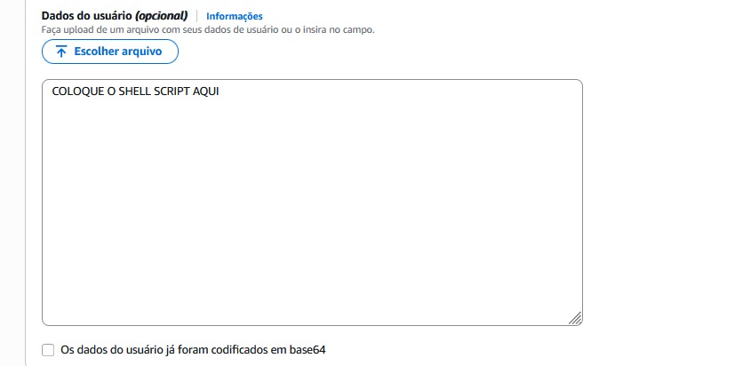

**Finalmente**, após revisar todas as configurações (incluindo o armazenamento, se necessário), clique em **"Executar instância"** (botão laranja no canto inferior direito, que aparecerá após rolar a página para baixo). Sua instância será lançada e executará o script fornecido automaticamente.
# Guia de Criação de Webhook no Discord

Este guia passo a passo demonstra como criar um webhook no Discord, permitindo que você envie mensagens de aplicativos externos (como seu monitoramento AWS) para um canal específico no seu servidor Discord.

---

## Criação do webhook no discord

### 1. Acessar as Configurações do Canal no Discord

Abra seu servidor Discord. Localize o canal onde você deseja que o webhook envie as mensagens (neste exemplo, `#geral`). Clique no ícone de engrenagem (Configurações) ao lado do nome do canal.

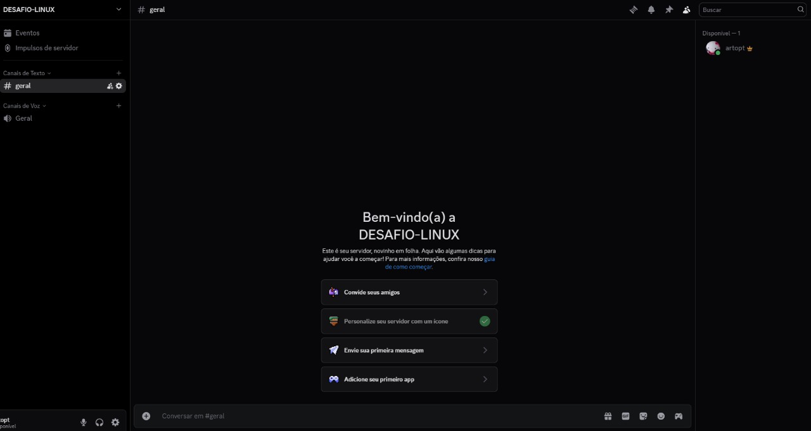

### 2. Acessar a Visão Geral do Canal

No menu de configurações do canal, certifique-se de que a opção **"Visão geral"** esteja selecionada. Aqui você pode ver o nome e outras configurações básicas do canal.

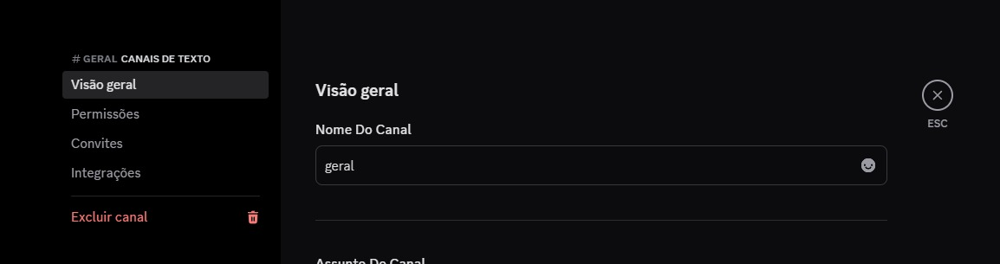

### 3. Navegar para a Seção de Integrações

No menu lateral esquerdo das configurações do canal, clique em **"Integrações"**. Esta seção é onde você gerencia webhooks e outras integrações para o canal.

Aqui, clique no botão **"Novo webhook"**.

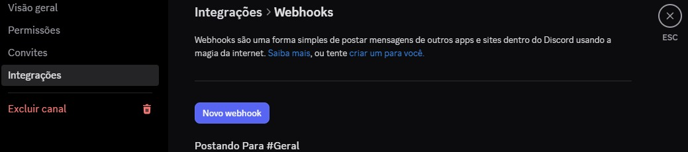

### 4. Configurar e Copiar o URL do Webhook

Após clicar em "Novo webhook", você verá a tela de configuração do seu novo webhook.
* Você pode personalizar o **Nome** do seu bot (ex: `Spidey Bot`).
* Verifique se o **Canal** selecionado é o correto (ex: `#geral`).
* Você também pode alterar a imagem do perfil do bot, se desejar.

O mais importante é o botão **"Copiar URL do webhook"**. Clique nele para copiar a URL do seu webhook para a área de transferência. Esta URL é o endpoint para onde você enviará as mensagens.

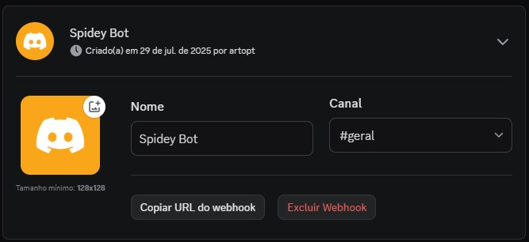

---

Com a URL do webhook copiada, você pode usá-la em seus aplicativos ou scripts (como o `monitor.sh` da sua instância EC2) para enviar notificações diretamente para o canal Discord configurado. Lembre-se de manter esta URL segura, pois qualquer pessoa com acesso a ela pode postar mensagens no seu canal.


---

## 🚀 Como Executar o Projeto

Para colocar este projeto em funcionamento, siga os passos abaixo. O método recomendado é usar o script `user-data.sh` ao criar uma instância EC2 na AWS.

### Pré-requisitos

* Uma conta na AWS.
* [Git](https://git-scm.com/downloads) instalado no seu computador.
* Um editor de código (como o [VS Code](https://code.visualstudio.com/)).
* Um Webhook URL do Discord (veja o guia no final).

### Passo a Passo da Execução


1.  **Prepare o Script `user-data.sh`**
    * Abra o arquivo `user-data.sh` no seu editor de código.
    * Revise o script para garantir que ele atende às suas necessidades. O script padrão já está pronto para uso que esta em **`scripts/setup/user_data.sh`**.


2.  **Configure as Variáveis de Ambiente na Instância**
    * Após a instância ser criada, encontre seu endereço IP público no painel EC2.
    * Siga as instruções da seção **"⚙️ Configuração Pós-Implantação"** (logo abaixo) para se conectar via SSH e configurar as variáveis `WEBHOOK_URL` e `URL_SERVIDOR`.

Após completar esses passos, seu servidor estará configurado, a página web estará no ar e o monitoramento começará a enviar relatórios para o seu Discord a cada minuto.

---

## ⚙️ Configuração Pós-Implantação: Editando as Variáveis de Ambiente

Após a instância ser criada e o script de User Data ser executado, há um passo manual **essencial** para fazer o monitoramento funcionar. Você precisa se conectar à instância via SSH para configurar duas variáveis de ambiente.

As duas variáveis necessárias são:

1.  `WEBHOOK_URL`: A URL secreta do seu canal do Discord, para onde as notificações serão enviadas.
2.  `URL_SERVIDOR`: O endereço público da sua própria instância EC2 (ex: `http://4.148.134.1`). Isso permite que o script verifique o status do servidor pelo seu IP público.

### Passo a Passo para Configurar as Variáveis de ambiente

1.  **Conecte-se à sua instância EC2 via SSH** usando o arquivo `.pem` que você salvou.
    ```bash
    ssh -i /caminho/para/sua/chave.pem ubuntu@SEU_IP_PUBLICO
    ```

2.  **Navegue até o diretório dos scripts**:
    ```bash
    cd /home/ubuntu/scripts
    ```

3.  **Abra o arquivo de ambiente com o editor `nano`**:
    ```bash
    nano .env
    ```

4.  **Preencha o arquivo `.env`**. Ele estará vazio. Cole o conteúdo abaixo, substituindo os valores de exemplo pelos seus:
    ```env
    WEBHOOK_URL="COLE_AQUI_A_URL_DO_SEU_WEBHOOK_DO_DISCORD"
    URL_SERVIDOR="http://COLE_AQUI_O_IP_PUBLICO_DA_SUA_INSTANCIA_EC2"
    ```
    * **Dica:** O endereço IP público da sua instância pode ser encontrado no painel EC2. Lembre-se de adicionar `http://` no início.

5.  **Salve e saia do `nano`**:
    * Pressione `Ctrl + X`.
    * Pressione `S` (ou `Y` em inglês) para confirmar que deseja salvar.
    * Pressione `Enter` para confirmar o nome do arquivo.

Pronto! Agora o seu sistema de monitoramento está 100% configurado e já começará a enviar os relatórios para o seu Discord.

## 🛠️ Comandos Úteis para Cron e Debug

Depois de configurar tudo, estes comandos são úteis para gerenciar e depurar o agendamento de tarefas (`cron`) na sua instância.

* **Verificar os Jobs Agendados**
    * Para listar todas as tarefas que o `cron` está configurado para executar para o usuário atual.
    ```bash
    crontab -l
    ```

* **Editar os Jobs Agendados**
    * Abre o editor de texto padrão (geralmente `nano`) para adicionar, modificar ou remover tarefas do `cron`.
    ```bash
    crontab -e
    ```

* **Verificar o Log do Script de Monitoramento**
    * Para ver a saída em tempo real do seu script `monitor.sh` e o resultado das verificações de status. Pressione `Ctrl + C` para sair.
    ```bash
    tail -f /var/log/monitoramento.log
    ```

* **Verificar o Log do Sistema para o Cron**
    * Essencial para depurar se o `cron` está realmente tentando executar sua tarefa. Este comando filtra o log geral do sistema e mostra apenas as linhas relacionadas ao `cron`.
    ```bash
    grep CRON /var/log/syslog
    ```

* **Verificar o Status do Serviço Cron**
    * Para garantir que o serviço (daemon) do `cron` está ativo e funcionando no sistema.
    ```bash
    systemctl status cron
    ```

* **Executar o Script Manualmente**
    * Para testar o `monitor.sh` imediatamente e ver qualquer saída ou erro diretamente no terminal, sem esperar pelo `cron`.
    ```bash
    bash /home/ubuntu/scripts/monitor.sh
    ```

* **Remover Todos os Jobs (CUIDADO!)**
    * Este comando remove **todas** as tarefas agendadas para o usuário atual sem pedir confirmação. Use com extrema cautela.
    ```bash
    crontab -r
    ```
````


